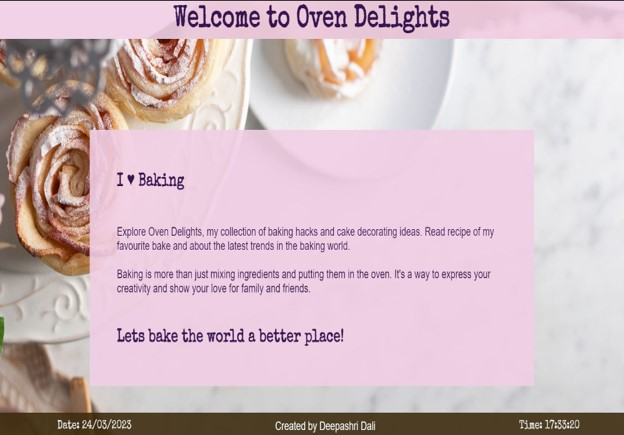

# Hobby pgae

## Description

Hobby page is about my passion for baking and is called Oven Delights. The site has a header and footer and is divided into 5 sections.

1.  Introduction section
2.  My favourite bake
3.  My baking hacks
4.  My cake topping ideas
5.  Baking trends

## Features

\* The page is visually interesting, with a fixed background image which is visible as all the sections scroll over it. To make the effect better the sections have a transparent background.

\* The header and footer are fixed and the footer displays date and time using javascript.

\* The site has a lot of information but is easy to follow as I have used lists to display content in many of the sections and also given an external link of my recommended baking resource for further information.

\* I have used flexbox to display images and the site has a responsive layout with the use of media queries.
